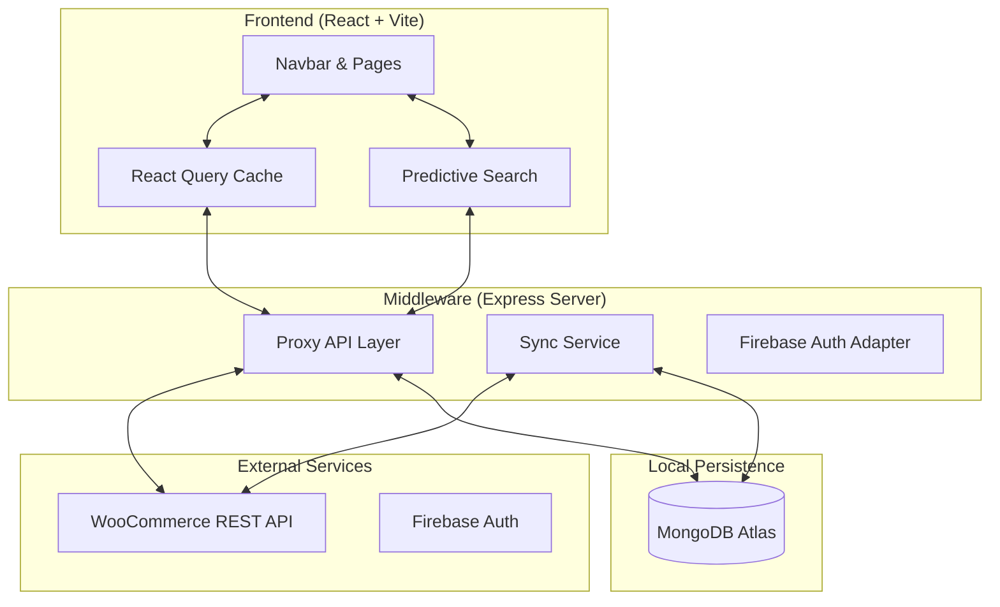

# Luxtronics - Final Architecture & Data Flow

## 🏗️ System Overview
Luxtronics is a high-performance E-commerce platform built to handle large product catalogs (up to 1,00,000+ items) using a **Hybrid Architecture** (Real-time Proxy + Database Sync).

---

## 🎯 Architecture Diagram



---

## 🔄 Core Data Flows

### 1. Search & Suggestions Flow
1.  **User Types**: User enters "Iphone" in the Navbar search bar.
2.  **Debounce**: System waits 300ms to avoid excessive API calls.
3.  **Fetch**: Frontend calls `/api/products?search=iphone`.
4.  **Proxy**: Express server forwards request to WooCommerce (or queries MongoDB for speed).
5.  **Map**: Data is transformed from WooCommerce format to Luxtronics `Product` format.
6.  **Display**: Predictive suggestions appear with real-time prices & images.

### 2. Product Detail Flow
1.  **Slug Navigation**: User clicks a product.
2.  **Fetch by Slug**: Server looks up `/api/products/slug/:slug`.
3.  **Variation Selection**: Frontend auto-selects the first available variation.
4.  **Price Sync**: Currency context ensures price matches user's location (INR/USD).

### 3. Catalog Sync Flow (Background)
1.  **Trigger**: Admin runs `npm run sync:full`.
2.  **Batching**: Backend fetches products in batches of 100 from WooCommerce.
3.  **Persistence**: Products are saved/updated in **MongoDB Atlas**.
4.  **Availability**: Frontend can now query MongoDB directly for 10x faster filtering.

---

## 🛠️ Technology Stack

| Layer | Technology |
| :--- | :--- |
| **Frontend** | React 18, TypeScript, Vite, Tailwind CSS, Framer Motion |
| **Backend** | Node.js, Express |
| **Database** | MongoDB Atlas (Product Cache), WooCommerce (Source of Truth) |
| **State Management** | React Query (TanStack Query) |
| **Auth** | Firebase Authentication |
| **Deployment** | Jenkins CI/CD, Hostinger (LiteSpeed) |

---

## 📁 Optimized Folder Structure

```text
Luxtronics/
├── backend/            # Server-side logic
│   ├── scripts/        # Deployment & Sync scripts
│   └── server/         # Express API, Models, & Services
├── frontend/           # Client-side source code
│   ├── public/         # Static assets
│   └── src/
│       ├── components/ # Reusable UI components
│       ├── context/    # Currency & Auth contexts
│       ├── pages/      # Main application views
│       └── services/   # API client (Store API)
├── docs/               # Detailed documentation & guides
├── scripts/            # Infrastructure & setup scripts
├── server.js           # Production entry point (Proxy + SPA Host)
├── package.json        # Unified dependency management
└── build/              # Production artifacts (Git ignored)
```

---

## 🚀 Deployment Strategy

### Branching Model
*   **`main`**: Production-ready code. Deploys to `public_html/`.
*   **`staging`**: Testing environment. Deploys to `public_html/staging/`.

### Deployment Commands
*   **Production**: `npm run deploy`
*   **Staging**: `npm run deploy:staging`

---

## ⚡ Performance Highlights
*   **Asset Mapper**: Handles hashed filenames to prevent 404s after updates.
*   **Image Skeletons**: Smooth loading states for search & product cards.
*   **Price Resilience**: Defensive mapping ensures no `₹0` or crashes on missing data.
*   **Debounced Input**: Reduces server load during typing.

---
*Created on: 2026-05-10 | Status: STABLE ✅*
