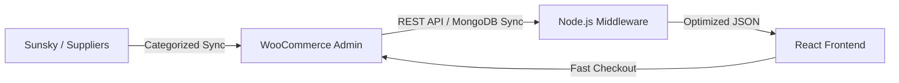

# Luxtronics: Quad-Layer Tech Synergy & Innovation

The Luxtronics platform isn't just an e-commerce site; it's a **High-Velocity Supply Chain Aggregator**. This document outlines the unique technical architecture that allows us to sync massive catalogs while maintaining ultra-fast loading speeds.

---

## 💎 The Unique Innovation

The Luxtronics "Secret Sauce" lies in its **Quad-Layer Orchestration**:

### 1. The Headless React Engine (`luxtronics.in`)
Unlike traditional WordPress sites that are slow and bulky, Luxtronics uses a **Modern React Frontend**. This allows for:
*   **Instant Page Transitions**: Navigating categories feels like a native app.
*   **Predictive Search**: Real-time product discovery without page reloads.
*   **Custom Design Control**: A premium, dark-themed UI that is impossible to achieve with standard WordPress themes.

### 2. The Core Admin & Order Hub (`luxtronics.luxtronics.in`)
We use a **Headless WordPress/WooCommerce** setup on a separate subdomain.
*   **Security**: The actual admin panel is decoupled from the user-facing site, reducing attack surfaces.
*   **Robust Management**: Leveraging the world's most stable order management system without its frontend performance baggage.

### 3. Real-Time Global Sourcing (`Sunsky Integration`)
Our system is architected to fetch and sync products directly from global suppliers like **Sunsky** by category.
*   **Infinite Inventory**: We can scale to millions of products without manual data entry.
*   **Dynamic Updating**: Stock and categories stay fresh through our automated sync services.

### 4. High-Performance Middleware (The Speed Layer)
Despite the complex data flow (Sunsky → WooCommerce → React), the site reloads **instantly**. How?
*   **MongoDB Product Cache**: We don't wait for WordPress. Our Node.js middleware fetches from a lightning-fast MongoDB Atlas cluster.
*   **Asset Mapper**: Prevents stale cache issues, ensuring the browser always loads the latest optimized code.
*   **Efficient Proxying**: Single-hop API calls minimize network latency.

---

## 🔄 The Data Flow: "Global to Local"

---

## 🏆 Competitive Advantage

| Feature | Traditional WooCommerce | **Luxtronics Architecture** |
| :--- | :--- | :--- |
| **Speed** | 4s - 8s (Slow) | **0.5s - 1.5s (Ultra-Fast)** |
| **Scalability** | Struggles at 10k products | **Handles 100k+ with ease** |
| **Security** | Vulnerable to PHP exploits | **Decoupled Headless Security** |
| **UX** | Generic Templates | **Premium App-like Experience** |

---
**This unique multi-layer approach makes Luxtronics a market leader in speed and catalog volume.** 🚀
